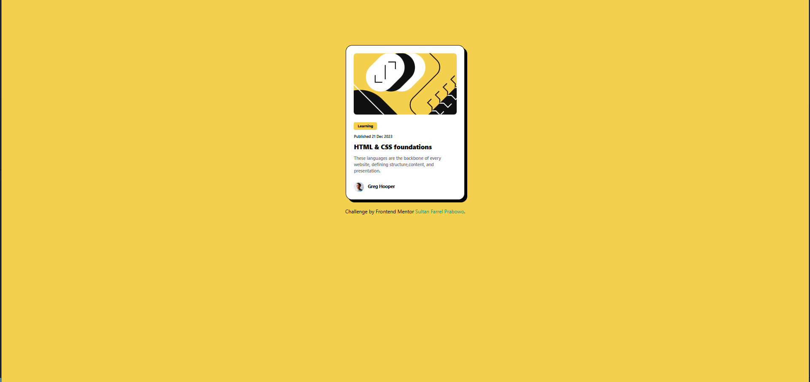
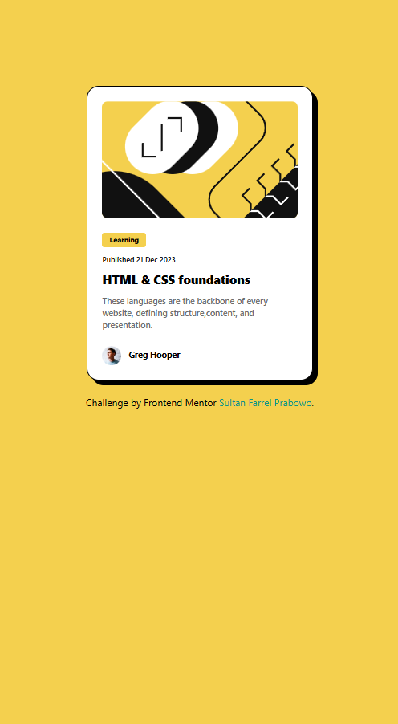

# Frontend Mentor - Blog preview card solution

This is a solution to the [Blog preview card challenge on Frontend Mentor](https://www.frontendmentor.io/challenges/blog-preview-card-ckPaj01IcS). Frontend Mentor challenges help you improve your coding skills by building realistic projects. 

## Table of contents

- [Overview](#overview)
  - [Screenshot](#screenshot)
  - [Links](#links)
  - [Built with](#built-with)
- [Author](#author)

## Overview
### Blog Preview Card Component
This project is a Blog Preview Card Component designed to display a concise summary of a blog post or article. The card showcases essential information, such as the publication date, author, and topic, while maintaining a clean and modern design aesthetic.

#### Features:
* Eye-catching Image: The card includes a visually appealing image at the top, drawing attention to the article.
* Category Tag: A highlighted category label makes it easy to identify the topic at a glance.
* Publication Information: Displays the date the article was published along with the author's name, giving the card a professional and editorial feel.
* Stylized Shadow Effect: The card features a distinctive shadow effect on the bottom and right, adding depth and making the card stand out on the page.
* Mobile-Friendly Design: This component is responsive and optimized for mobile devices, ensuring that it looks great on all screen sizes.
This project is built using HTML and Tailwind CSS, leveraging Tailwind's utility-first approach to ensure that the design is flexible, modular, and easy to customize. The shadow effect, rounded corners, and other stylistic choices contribute to a modern and minimalistic look.

Feel free to explore and use this component in your own projects, whether for blog previews or other content that benefits from a compact, visually striking design.

### Screenshot

### Links

- Solution URL: [Add solution URL here](https://your-solution-url.com)
- Live Site URL: [Add live site URL here](https://your-live-site-url.com)

### Built with

- Semantic HTML5 markup
- Tailwind CSS
- Flexbox
- Mobile-first workflow

## Author

- Website - [Sultan Farrel](https://www.sultanf.my.id)
- Frontend Mentor - [@SultanFarrel](https://www.frontendmentor.io/profile/SultanFarrel)
- Instagram - [@farrelsultan15](https://www.instagram.com/farrelsultan15)
